```python
from IPython.display import HTML

HTML('''<script>
code_show=true; 
function code_toggle() {
 if (code_show){
 $('div.input').hide();
 } else {
 $('div.input').show();
 }
 code_show = !code_show
} 
$( document ).ready(code_toggle);
</script>
<form action="javascript:code_toggle()"><input type="submit" value="Click here to toggle on/off the raw code."></form>''')
```


<script>
code_show=true; 
function code_toggle() {
 if (code_show){
 $('div.input').hide();
 } else {
 $('div.input').show();
 }
 code_show = !code_show
} 
$( document ).ready(code_toggle);
</script>
<form action="javascript:code_toggle()"><input type="submit" value="Click here to toggle on/off the raw code."></form>


# Generating Covariates for the LD4 Passages Data

In this notebook, we create a csv of covariates that can be combined with analysis-specific design matrices for controlling for various confounding factors, including age, comprehension, etc. The datasets in which these covariates are housed are multiple, so we will have to iterate through them, generating plots and summary metrics as we go. 

Potential sources of confounding information are:

- Basic demographics, such as Age and Sex
- Motion
- The Post-Scan Comprehension Questionnaire
- In-Scan ePrime Metrics, including the Comprehension and Attention Task


```python
import os, pandas as pd, numpy as np, redcap, matplotlib.pyplot as plt
from glob import glob
import localdata # Personal database with API Tokens
wd = '/fs0/users/bailesk1/LD4_LongMod_SupportDocs'
```

## Initialize QA Database

The first thing we will do is create a template for the final QA database. This should have all the available subject IDs in it, so that we can reference this for future operations. 


```python
qadf = pd.read_csv('{}/scanlist.txt'.format(wd), names=['scan', 'session'], index_col='scan')
qadf['scantype'] = [x.split('_')[1] for x in qadf.index]
qadf['modality'] = [x[0] for x in qadf.scantype]
qadf['genre'] = [x[1] for x in qadf.scantype]
qadf['year'] = [x[2] for x in qadf.scantype]
```

### Pull Demographic Data from REDCap


```python
# Initialize the Demographics Dataframe
ddf = qadf[['session', 'scantype', 'modality', 'genre', 'year']]
ddf.loc[:,'img_index'] = ['{}_{}'.format(subjid.split('_')[0][2:], sess) for subjid, sess \
                          in zip(ddf.index, ddf.session)]
ddf.loc[:,'bx_index'] = ['{}'.format(subjid.split('_')[0][2:]) for subjid in ddf.index]
ddf.bx_index = ddf.bx_index.astype(int)
ddf.loc[:,'age'] = np.nan
ddf.loc[:,'sex'] = np.nan


# Define a function for calculating age from two date-strings
def calcAge(dob, doe):
    from datetime import datetime
    dob = datetime.strptime(dob, '%Y-%m-%d') 
    doe = datetime.strptime(doe, '%Y-%m-%d')
    td = doe-dob
    age_in_years = float(td.days)/365.2425
    return age_in_years

# Grab data from the Imaging Database
project = redcap.Project(url='https://redcap.vanderbilt.edu/api/', \
                         token=localdata.RCTOKENS['LD4_Imaging'])
rcdf = project.export_records(format='df',forms=['demographics', 'prepost_knowledge', 'imaging_new'])
rcdf['subject'] = ['LD{}'.format(name.split('_')[0]) for name in rcdf.index]
rcdf['session'] = [name.split('_')[1] for name in rcdf.index]

# Loop through the Imaging Database and Calculate age at scan
for subj in rcdf.index:
    try:
        age_at_scan = calcAge(rcdf.loc[subj, 'dateofbirth'], \
                               rcdf.loc[subj, 'dateofeval'])
        ddf.loc[ddf.img_index == subj, 'age'] = age_at_scan
    except:
        pass
    
# Read in the Bx REDCap database
project = redcap.Project(url='https://redcap.vanderbilt.edu/api/', \
                         token=localdata.RCTOKENS['LD4_Bx'])
rc2df = project.export_records(format='df') #,forms=['demographics'])

# Loop through Bx Database and Grab Subject Sex
for subj in rc2df.index:
    ddf.loc[ddf.bx_index == subj, 'sex'] = rc2df.loc[subj, 'sex']
```

    /home/bailesk1/.conda/envs/py3/lib/python3.6/site-packages/ipykernel_launcher.py:28: DeprecationWarning: 
    .ix is deprecated. Please use
    .loc for label based indexing or
    .iloc for positional indexing
    
    See the documentation here:
    http://pandas.pydata.org/pandas-docs/stable/indexing.html#deprecate_ix
    /home/bailesk1/.conda/envs/py3/lib/python3.6/site-packages/ipykernel_launcher.py:39: DeprecationWarning: 
    .ix is deprecated. Please use
    .loc for label based indexing or
    .iloc for positional indexing
    
    See the documentation here:
    http://pandas.pydata.org/pandas-docs/stable/indexing.html#deprecate_ix


## Scanner Comprehension

#####  Read in Passages Data
First, we need to import relevant packages and export the LD4_Imaging Database from REDcap. We will later change this database from long format to wide format, so that we can look at each individual and their performance across runs each year. 

Then, we want to build the REDCap dataframe which houses all the passage comprhension scores. Finally, we loop through the fields and group the ones relating to comprehension together, within passage. 


```python
passage_dict = {'hang_gliding': 'ae2', 'kittens': 'an2', \
                'strawberries': 'an3', 'wrasses': 'ae3', \
                'hydroponics': 've3', 'kickball': 'vn3', \
                'velvetworms': 've4', 'marbles': 'vn4', \
                'funguses': 'ae4', 'frogs': 'an4'}

passcol_sets = dict()
for passage in passage_dict.keys():
    passcols = list()
    for col in rcdf.columns.tolist():
        if (passage in col) and ('pass_comp' in col) and ('post' in col):
            passcols.append(col)
    passcol_sets[passage] = passcols
```

To get the summary phrase-level knowledge information for each run, we loop through each passage and sum up the total recalled phrases for each. 

Combine the QAdf and the Phrase-Level DF together. This requires looping through each scan in the qadf, then finding the corresponding passage value from the phrase-df. 


```python
# Build an empty "Phrase DF"
pdf = qadf[['session', 'scantype', 'modality', 'genre', 'year']]

# Create composite and vectors of passages data from RCDF
for passage in passage_dict.keys():
    phrase_vecs = rcdf[passcol_sets[passage]].values.tolist()
    total_phrases = rcdf[passcol_sets[passage]].sum(axis=1)
    rcdf['sum_{}'.format(passage)] = total_phrases
    rcdf['vec_{}'.format(passage)] = phrase_vecs
    
# Transfer Summary measures from RCDF to Appropriate run in PDF
pdf.loc[:,'sum_comp_qs'] = np.nan
for row in pdf.index:
    rcdf_index = '{}_{}'.format(row.split('_')[0][2:], pdf.loc[row,'session'])
    try:
        for passage in passage_dict.keys():
            if pdf.loc[row, 'scantype'] == passage_dict[passage]:
                pdf.loc[row, 'sum_comp_qs'] = rcdf.loc[rcdf_index, 'sum_{}'.format(passage)]
    except:
        pass
            
# Create a an array for the different passages, showing comprehension
vecMat = np.zeros([len(qadf), 30, 10]) # Initialize the SubjXQuestionXPassage array
pass_list = ['hang_gliding', 'kittens', \
             'hydroponics',  'strawberries', 'velvetworms', 'marbles', \
             'wrasses', 'kickball', 'funguses', 'frogs']
passage_tkr = 0

for ii in range(0, len(pass_list)):
    passage = pass_list[ii]
    for jj in range(0, len(pdf.index)):
        row = qadf.index[jj]
        rcdf_index = '{}_{}'.format(row.split('_')[0][2:], qadf.loc[row,'session'])
        try:
            if pdf.loc[row, 'scantype'] == passage_dict[passage]:
                phrasevec = np.array(rcdf.loc[rcdf_index, 'vec_{}'.format(passage)])
                vecMat[jj, range(0,len(phrasevec)), ii] = phrasevec 
        except:
            pass
# Sum Across Subjects to get total number for each recalled phrase
vecMat = vecMat.sum(axis=0)
```

    /home/bailesk1/.conda/envs/py3/lib/python3.6/site-packages/ipykernel_launcher.py:14: DeprecationWarning: 
    .ix is deprecated. Please use
    .loc for label based indexing or
    .iloc for positional indexing
    
    See the documentation here:
    http://pandas.pydata.org/pandas-docs/stable/indexing.html#deprecate_ix
      


##### Display the recall, phrase-by-phrase for each passage. 
Overall, we see greater recall in narrative passages than in expository ones. We also see that there are certain keywords and phrases that are the "stickiest" throughout all the passages. For example, in the Velvet Worms passage, we see that the section in the middle is recalled more often than the section at the end. Additionally, one particilar phrase in funguses seems to be recalled quite often, even though the surrounding phrases are not as common. 


```python
%matplotlib inline

for ii in range(0,10):
    passtype = passage_dict[pass_list[ii]]
    if passtype=='vn4':
        fig = plt.figure()
        numsubj = len(qadf[qadf.scantype == passtype])

        ax = fig.add_subplot(1,1,1)    
        data = vecMat[:,ii]/numsubj*100
        data = data - np.mean(data)
        ax.bar(range(0,30), data)
        ax.set_xlim([1,30])
        ax.set_ylim([-50,50])
        ax.set_xticklabels('')
        ax.set_title('{}: {}'.format(pass_list[ii], passtype))

        plt.suptitle('% Recall Across Different Passages, by Phrase')
        plt.show()
```


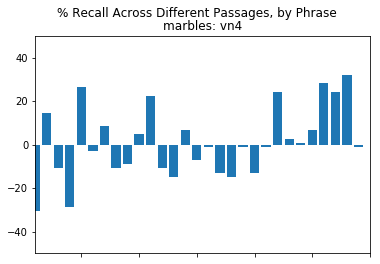


```python
%matplotlib inline

fig = plt.figure()
for ii in range(0,10):
    passtype = passage_dict[pass_list[ii]]
    numsubj = len(qadf[qadf.scantype == passtype])
    
    ax = fig.add_subplot(5,2,ii+1)    
    ax.bar(range(0,30), vecMat[:,ii]/numsubj*100)
    ax.set_xlim([1,30])
    ax.set_ylim([0,75])
    ax.set_xticklabels('')
    ax.set_title('{}: {}'.format(pass_list[ii], passtype))

plt.suptitle('% Recall Across Different Passages, by Phrase')
plt.show()
```


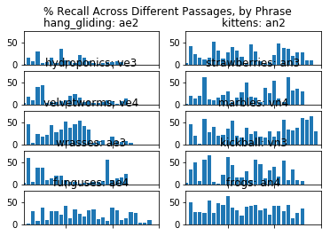


##### Display the amount of recall for each passage, by subject

Here, we display how well subjects recalled the passages, broken out by genre, year and modality. 

- Age: We see a trend of increasing recall with age. 
- Genre: There is also an apparently large effeect of genre on phrase recall. It's important to note, however, that each phrase is not wholely independent, e.g., if children paid a certain amount of attention, they could easily recall 15 phrases from narrative text; whereas the same attentive subjects may only recall a small portion of phrases in expository. 
- Modality: There does not seem to be a large effect of modality on recall, even within individual timepoints. 


```python
%matplotlib inline
fig, axes = plt.subplots(nrows=1, ncols=3)
pdf.boxplot(by=['modality'], column='sum_comp_qs', ax=axes[0])
pdf.boxplot(by=['genre'], column='sum_comp_qs', ax=axes[1])
pdf.boxplot(by=['year'], column='sum_comp_qs', ax=axes[2])

axes[0].set_title('')
axes[1].set_title('')
axes[2].set_title('')
fig.suptitle('Total Comp Questions Per Subject')

fig.show()
```

    /home/bailesk1/.conda/envs/py3/lib/python3.5/site-packages/matplotlib/figure.py:402: UserWarning: matplotlib is currently using a non-GUI backend, so cannot show the figure
      "matplotlib is currently using a non-GUI backend, "


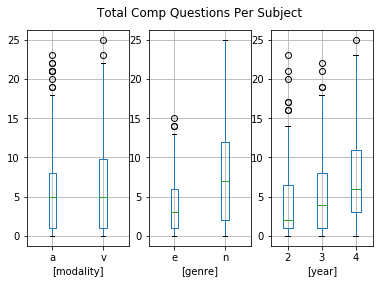


```python
%matplotlib inline
ax = pdf.boxplot(by=['modality', 'genre', 'year'], column='sum_comp_qs')
plt.title('')
plt.suptitle('Total Comp Questions Per Subject')
plt.show()
```


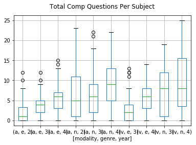


## E-Prime Data Analysis

Our next step is to gather information from the EPrime files. In particular, we are interested in two aspects of the scan: how well participants identified the "repeat" stimuli and whether they correctly answered the "comprehension" questions at the end of each passage run. 

To get at this, we will work with the ePrime output that's available on the server. The steps to perform are:

1. Read in the EPrime File
2. Extract data for a single run (two are included in each output)
3. Identify which year and run it is (e.g. ae3)
4. Assess Attn Task metrics and Comprehension metrics


```python
def calcAttnMetrics(blockdf):
        # Take in a df and spit out attention metrics
        
        # Extract Raw Data Vectors for Comparison
        bpress = (blockdf['Stim.RESP'] > 0) | (blockdf['Ch.RESP'] > 0)
        nopress = (blockdf['Stim.RESP'].isnull()) & (blockdf['Ch.RESP'].isnull())
        repeat = blockdf['Repeat'] > 0
        norepeat = blockdf['Repeat'] == 0
        
        # Calculate Summary Metrics
        true_hit = sum(bpress & repeat).astype(float) / sum(repeat)
        false_alarm = sum(bpress & norepeat).astype(float) / sum(norepeat)
        bad_miss = sum(nopress & repeat).astype(float) / sum(repeat)
        good_miss = sum(nopress & norepeat).astype(float) / sum(norepeat)
        
        return true_hit, false_alarm, bad_miss, good_miss
```


```python
# Initialize Eprime DataFrame
edf = qadf.loc[:, ['session', 'scantype', 'modality', 'genre', 'year']]
eprime_cols = ['eprime_exists', 'eprime_hitrate', 'eprime_falarmrate', \
               'eprime_badmissrate', 'eprime_goodmissrate', 'eprime_comp']
for col in eprime_cols:
    edf.loc[:,col] = np.nan

# Set up a slightly modified Passage Dict cor compatibility with ePrime
#passage_dict = {'Hang Gliding': 'ae2', 'Kittens': 'an2', 'Hydroponics': 'ae3', 'Wrasses': 've3', \
#                'Strawberries': 'an3', 'Dog': 'vn3', 'VelvetWorms': 've4', 'Funguses': 'ae4', \
#                'Marbles': 'vn4', 'Frogs': 'an4'}

#Set up Eprime
eprime_files = glob('{}/AllEPrimeData/??????_*.csv'.format(wd))    
bad_subjs = list()
for eprime_file in eprime_files:
    # Extract subject information from eprime filename
    filename = eprime_file.split('/')[-1]
    subject, scantype = filename.split('_') 
    scantype = scantype.split('.')[0]

    # Read the file
    df = pd.read_csv(eprime_file, header=0, delimiter=',', na_values='.')
    error_log = ''
    try:
        subject_id = '{}_{}'.format(subject, scantype)

        # Place into edf
        attn_cols = ['eprime_hitrate', 'eprime_falarmrate', \
                     'eprime_badmissrate', 'eprime_goodmissrate']
        true_hit, false_alarm, bad_miss, good_miss = calcAttnMetrics(df)
        edf.loc[subject_id, attn_cols] = [true_hit, false_alarm, bad_miss, good_miss]
        error_log += '\n\t assign metrics to eprime for {}'.format(subject_id)

        # Record Comprehension Measure Total (X out of 2)
        edf.loc[subject_id, 'eprime_comp'] = (sum(df['Picts1.ACC'].astype(int).unique()) + \
                                             sum(df['Picts2.ACC'].astype(int).unique()))
        error_log += '\n\t record comprehension done'

        # Note that Eprime Exists and was processed successfully
        edf.loc[subject_id, 'eprime_exists'] = 1
        error_log += '\n\t eprime exists updated'

    except:
        #bad_subjs.append(subject_id)
        # Note that Eprime files exists but was not processed successfully
        print(error_log)
        edf.loc[subject_id, 'eprime_exists'] = 2
        continue
```

    /home/bailesk1/.conda/envs/py3/lib/python3.6/site-packages/ipykernel_launcher.py:34: DeprecationWarning: 
    .ix is deprecated. Please use
    .loc for label based indexing or
    .iloc for positional indexing
    
    See the documentation here:
    http://pandas.pydata.org/pandas-docs/stable/indexing.html#deprecate_ix


    
    	 assign metrics to eprime for LD4100_an2
    
    	 assign metrics to eprime for LD4091_ae3
    
    	 assign metrics to eprime for LD4091_an3
    
    	 assign metrics to eprime for LD4094_an3
    
    	 assign metrics to eprime for LD4094_ae3


##### Generate E-Prime Passage-Level Results
E-Prime Hit rates and false alarm rates at the passage level.


```python
fig = plt.figure()
#edf.plot.scatter(x='eprime_hitrate', y='eprime_zhitrate')
#edf.plot.scatter(x='eprime_falarmrate', y='eprime_zfalarmrate')
edf.plot.scatter(x='eprime_zhitrate', y='eprime_dprime')
edf.plot.scatter(x='eprime_zfalarmrate', y='eprime_dprime')
plt.show()
```


    ---------------------------------------------------------------------------

    KeyError                                  Traceback (most recent call last)

    ~/.conda/envs/py3/lib/python3.6/site-packages/pandas/core/indexes/base.py in get_loc(self, key, method, tolerance)
       2441             try:
    -> 2442                 return self._engine.get_loc(key)
       2443             except KeyError:


    pandas/_libs/index.pyx in pandas._libs.index.IndexEngine.get_loc (pandas/_libs/index.c:5280)()


    pandas/_libs/index.pyx in pandas._libs.index.IndexEngine.get_loc (pandas/_libs/index.c:5126)()


    pandas/_libs/hashtable_class_helper.pxi in pandas._libs.hashtable.PyObjectHashTable.get_item (pandas/_libs/hashtable.c:20523)()


    pandas/_libs/hashtable_class_helper.pxi in pandas._libs.hashtable.PyObjectHashTable.get_item (pandas/_libs/hashtable.c:20477)()


    KeyError: 'eprime_zhitrate'

    
    During handling of the above exception, another exception occurred:


    KeyError                                  Traceback (most recent call last)

    <ipython-input-15-c9cee04ef4c0> in <module>()
          2 #edf.plot.scatter(x='eprime_hitrate', y='eprime_zhitrate')
          3 #edf.plot.scatter(x='eprime_falarmrate', y='eprime_zfalarmrate')
    ----> 4 edf.plot.scatter(x='eprime_zhitrate', y='eprime_dprime')
          5 edf.plot.scatter(x='eprime_zfalarmrate', y='eprime_dprime')
          6 plt.show()


    ~/.conda/envs/py3/lib/python3.6/site-packages/pandas/plotting/_core.py in scatter(self, x, y, s, c, **kwds)
       2793         axes : matplotlib.AxesSubplot or np.array of them
       2794         """
    -> 2795         return self(kind='scatter', x=x, y=y, c=c, s=s, **kwds)
       2796 
       2797     def hexbin(self, x, y, C=None, reduce_C_function=None, gridsize=None,


    ~/.conda/envs/py3/lib/python3.6/site-packages/pandas/plotting/_core.py in __call__(self, x, y, kind, ax, subplots, sharex, sharey, layout, figsize, use_index, title, grid, legend, style, logx, logy, loglog, xticks, yticks, xlim, ylim, rot, fontsize, colormap, table, yerr, xerr, secondary_y, sort_columns, **kwds)
       2615                           fontsize=fontsize, colormap=colormap, table=table,
       2616                           yerr=yerr, xerr=xerr, secondary_y=secondary_y,
    -> 2617                           sort_columns=sort_columns, **kwds)
       2618     __call__.__doc__ = plot_frame.__doc__
       2619 


    ~/.conda/envs/py3/lib/python3.6/site-packages/pandas/plotting/_core.py in plot_frame(data, x, y, kind, ax, subplots, sharex, sharey, layout, figsize, use_index, title, grid, legend, style, logx, logy, loglog, xticks, yticks, xlim, ylim, rot, fontsize, colormap, table, yerr, xerr, secondary_y, sort_columns, **kwds)
       1857                  yerr=yerr, xerr=xerr,
       1858                  secondary_y=secondary_y, sort_columns=sort_columns,
    -> 1859                  **kwds)
       1860 
       1861 


    ~/.conda/envs/py3/lib/python3.6/site-packages/pandas/plotting/_core.py in _plot(data, x, y, subplots, ax, kind, **kwds)
       1682         plot_obj = klass(data, subplots=subplots, ax=ax, kind=kind, **kwds)
       1683 
    -> 1684     plot_obj.generate()
       1685     plot_obj.draw()
       1686     return plot_obj.result


    ~/.conda/envs/py3/lib/python3.6/site-packages/pandas/plotting/_core.py in generate(self)
        238         self._compute_plot_data()
        239         self._setup_subplots()
    --> 240         self._make_plot()
        241         self._add_table()
        242         self._make_legend()


    ~/.conda/envs/py3/lib/python3.6/site-packages/pandas/plotting/_core.py in _make_plot(self)
        831         else:
        832             label = None
    --> 833         scatter = ax.scatter(data[x].values, data[y].values, c=c_values,
        834                              label=label, cmap=cmap, **self.kwds)
        835         if cb:


    ~/.conda/envs/py3/lib/python3.6/site-packages/pandas/core/frame.py in __getitem__(self, key)
       1962             return self._getitem_multilevel(key)
       1963         else:
    -> 1964             return self._getitem_column(key)
       1965 
       1966     def _getitem_column(self, key):


    ~/.conda/envs/py3/lib/python3.6/site-packages/pandas/core/frame.py in _getitem_column(self, key)
       1969         # get column
       1970         if self.columns.is_unique:
    -> 1971             return self._get_item_cache(key)
       1972 
       1973         # duplicate columns & possible reduce dimensionality


    ~/.conda/envs/py3/lib/python3.6/site-packages/pandas/core/generic.py in _get_item_cache(self, item)
       1643         res = cache.get(item)
       1644         if res is None:
    -> 1645             values = self._data.get(item)
       1646             res = self._box_item_values(item, values)
       1647             cache[item] = res


    ~/.conda/envs/py3/lib/python3.6/site-packages/pandas/core/internals.py in get(self, item, fastpath)
       3588 
       3589             if not isnull(item):
    -> 3590                 loc = self.items.get_loc(item)
       3591             else:
       3592                 indexer = np.arange(len(self.items))[isnull(self.items)]


    ~/.conda/envs/py3/lib/python3.6/site-packages/pandas/core/indexes/base.py in get_loc(self, key, method, tolerance)
       2442                 return self._engine.get_loc(key)
       2443             except KeyError:
    -> 2444                 return self._engine.get_loc(self._maybe_cast_indexer(key))
       2445 
       2446         indexer = self.get_indexer([key], method=method, tolerance=tolerance)


    pandas/_libs/index.pyx in pandas._libs.index.IndexEngine.get_loc (pandas/_libs/index.c:5280)()


    pandas/_libs/index.pyx in pandas._libs.index.IndexEngine.get_loc (pandas/_libs/index.c:5126)()


    pandas/_libs/hashtable_class_helper.pxi in pandas._libs.hashtable.PyObjectHashTable.get_item (pandas/_libs/hashtable.c:20523)()


    pandas/_libs/hashtable_class_helper.pxi in pandas._libs.hashtable.PyObjectHashTable.get_item (pandas/_libs/hashtable.c:20477)()


    KeyError: 'eprime_zhitrate'


```python
#edf.groupby('scantype').agg({'eprime_hitrate': [np.mean, np.std]})
for col, zcol in [('eprime_hitrate', 'eprime_zhitrate'), ('eprime_falarmrate', 'eprime_zfalarmrate')]:
    col_means = edf.groupby('scantype')[col].transform(np.mean)
    col_std = edf.groupby('scantype')[col].transform(np.std)
    edf[zcol] = (edf[col] - col_means) / col_std
edf['eprime_dprime'] = edf['eprime_zhitrate'] - edf['eprime_zfalarmrate']
```

##### Validate the Eprime DPrime Composite Measure

Our first question is, how should we use these metrics? The most salient ones are likely to be the "Repeat" attention task hit rate (i.e. out of 8 repeats, how many did you detcet?), and the "False Alarm" rate (i.e. how many times did you press a button when you were not supposed to?

Generally, we expect that children will do one of three things: 
- they will be attentive and do well (high hit rate, low false alarm rate0
- they will press the button a lot, perhaps out of boredom (high hit rate, high false alarm rate)
- they will not press button at all, since they fell asleep (low hit rate, low false alarm rate)

Ideally, we would find a cutoff that cuts nicely along each of these variables. The D-Prime metric is the difference between these two measures, after z-normalization, and provides a viable option for summarizing scanner performance.

From a visualization of the data, we can see that a D-Prime score of -2 is just below the lowest score of any "high-performing" subject, as defined by a hit rate higher than 50%, and a false alarm rate lower than 10%. Therefore, this rate may be a good threshold to employ. 


```python
%matplotlib inline

ghr = 0.5
gfar = 0.1
goodrate_df = edf.loc[(edf.eprime_hitrate > ghr) & (edf.eprime_falarmrate < gfar)]
badhitrate_df =  edf.loc[(edf.eprime_hitrate < ghr) & (edf.eprime_falarmrate < gfar)]
badfalarmrate_df =  edf.loc[(edf.eprime_hitrate > ghr) & (edf.eprime_falarmrate > gfar)]
badrate_df = edf.loc[(edf.eprime_hitrate < ghr) & (edf.eprime_falarmrate > gfar)]

h = plt.figure()
h.add_subplot(1,2,1)
plt.scatter(goodrate_df.eprime_dprime, goodrate_df.eprime_hitrate, color='g')
plt.scatter(badhitrate_df.eprime_dprime, badhitrate_df.eprime_hitrate, color='b')
plt.scatter(badfalarmrate_df.eprime_dprime, badfalarmrate_df.eprime_hitrate, color='y')
plt.scatter(badrate_df.eprime_dprime, badrate_df.eprime_hitrate, color='r')
plt.plot([-2, -2], [0, 1], color='r')

plt.xlabel('Eprime Dprime')
plt.ylabel('Repeat Hit Rate (%)')
plt.ylim([0, 1.05])

h.add_subplot(1,2,2)
plt.scatter(goodrate_df.eprime_dprime, goodrate_df.eprime_falarmrate, color='g')
plt.scatter(badhitrate_df.eprime_dprime, badhitrate_df.eprime_falarmrate, color='b')
plt.scatter(badfalarmrate_df.eprime_dprime, badfalarmrate_df.eprime_falarmrate, color='y')
plt.scatter(badrate_df.eprime_dprime, badrate_df.eprime_falarmrate, color='r')

plt.plot([-2, -2], [0, 1], color='r')

plt.legend(['DP Cutoff', 'AllGood', 'BadHitRate', 'BadFAlarms', 'AllBad'], loc='upper right')
plt.xlabel('Eprime Dprime')
plt.ylabel('False Alarm Rate (%)')
plt.ylim([-0.05, 1])

plt.suptitle('Eprime Dprime vs. Raw Hit Rate and False Alarm Rates')
plt.show()
```


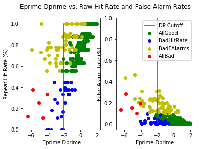


##### Display the Distributions of the Composite Eprime Metric (DPrime) Across Scans

We find further support for the performance rate threshold of D' < -2 by examining its distribution across the whole sample, and across each run. 

In the overal distribution, we observe what might be a secondary distribution of D' scores, centered on D' = -3. These could correspond to poor performers across both false alarm and hit rates -- subjects who just didn't perform well.

However, boxplots show that D'~=-3 is the outer range of the distribution for most scan types, so this may also be a good cutoff. Alternatively, we could have a scan-specific cut off based on the group performance. (e.g. D' = -2 would be quite low for VE4.)


```python
%matplotlib inline
edf.hist(column='eprime_dprime', bins=30)
plt.title('Distribution of Eprime_Dprime Across All Scan Groups')
plt.show()
```


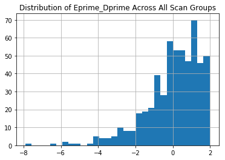


```python
%matplotlib inline
ecol = 'eprime_falarmrate'

fig, axes = plt.subplots(nrows=1, ncols=3)
edf.boxplot(by='modality', column=ecol, ax=axes[0])
edf.boxplot(by='genre', column=ecol, ax=axes[1])
edf.boxplot(by='year', column=ecol, ax=axes[2])

axes[0].set_title('')
axes[1].set_title('')
axes[2].set_title('')
fig.suptitle('{} Across Modality, Genre, year'.format(ecol))

fig.show()
```

    /home/bailesk1/.conda/envs/py3/lib/python3.5/site-packages/matplotlib/figure.py:402: UserWarning: matplotlib is currently using a non-GUI backend, so cannot show the figure
      "matplotlib is currently using a non-GUI backend, "


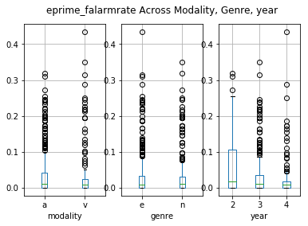


```python
%matplotlib inline
ax = edf.boxplot(by=['year', 'modality', 'genre'], column='eprime_dprime')
plt.title('')
plt.suptitle('Eprime_Dprime Across Each Scan Run')
plt.show()
```


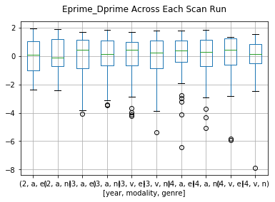


##### Look at Comprehension Measures

Overall, most subjects performed adequately on the brief, in-scanner comprehension measure. This could be used as an alternative "save the subject" measure, in which subjects with low D' scores are shown to be paying attention if they get both questions correct. 


```python
%matplotlib inline
edf.hist(by=['year', 'modality','genre'], column='eprime_comp', range=[0,2], sharey=True, layout=[6,2])
plt.suptitle('EPrime_Comp Across Modality, Genre, year')
plt.show()
```


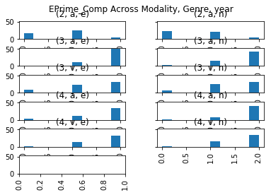


## Analyze Scanner Motion
Next, we want to analyze in-scanner motion. To do this, we will extract the art measures (global signal change and # of outliers) from the art folder in each Feat directory. Then, we will check to see how they are related and whether there are any good cutoff points.


```python
motion_file = '/fs0/users/bailesk1/LD4_LongMod_SupportDocs/motion/summary.csv'
mdf = pd.read_csv(motion_file, index_col='subject')
mdf['scantype'] = [f.split('_')[1] for f in mdf.index]
```

##### Check Distribution of Scan Outliers

We see that, across scans, there is a strong relatinship between the mean amount of "framewise" signal change (ART's "global signal" measure) and the percentage of the scan that were outliers. This means we can probably focus on an intuitive metric like "percent outliers" as our measure of interest. 

Across all scans, we see improvement in motion quality as subjects get older, as we might expect. However, we also see some differences between modality, which might be unexpected and confounding. Participants move slightly more in the auditory task than in the visual one, and this is particularly pronounced in the fourth year. 

Adding in a scan-level motion covariate to our group-level model is likely to be helpful in accounting for these effects. 


```python
%matplotlib inline 
plt.scatter(mdf['outs'], mdf['mean'])
plt.xlabel('Percent of Outlier Frames')
plt.ylabel('Mean Global Framewise Signal Change')
plt.title('A Strong Linear Relationship between \nFramewise Signal Change and Outliers')
plt.show()
```


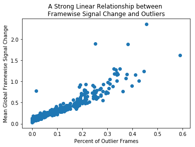


```python
mdf.head()
```


<div>
<style>
    .dataframe thead tr:only-child th {
        text-align: right;
    }

    .dataframe thead th {
        text-align: left;
    }

    .dataframe tbody tr th {
        vertical-align: top;
    }
</style>
<table border="1" class="dataframe">
  <thead>
    <tr style="text-align: right;">
      <th></th>
      <th>thresh</th>
      <th>mtype</th>
      <th>outs</th>
      <th>mean</th>
      <th>max</th>
      <th>scantype</th>
    </tr>
    <tr>
      <th>subject</th>
      <th></th>
      <th></th>
      <th></th>
      <th></th>
      <th></th>
      <th></th>
    </tr>
  </thead>
  <tbody>
    <tr>
      <th>LD4002_ae3</th>
      <td>7</td>
      <td>fdrms</td>
      <td>0.112450</td>
      <td>0.384671</td>
      <td>7.111040</td>
      <td>ae3</td>
    </tr>
    <tr>
      <th>LD4001_vn3</th>
      <td>7</td>
      <td>fdrms</td>
      <td>0.000000</td>
      <td>0.077976</td>
      <td>0.304692</td>
      <td>vn3</td>
    </tr>
    <tr>
      <th>LD4001_ve3</th>
      <td>7</td>
      <td>fdrms</td>
      <td>0.064257</td>
      <td>0.213931</td>
      <td>1.958320</td>
      <td>ve3</td>
    </tr>
    <tr>
      <th>LD4002_an3</th>
      <td>7</td>
      <td>fdrms</td>
      <td>0.120482</td>
      <td>0.366145</td>
      <td>7.352280</td>
      <td>an3</td>
    </tr>
    <tr>
      <th>LD4002_an4</th>
      <td>7</td>
      <td>fdrms</td>
      <td>0.016064</td>
      <td>0.105443</td>
      <td>3.784150</td>
      <td>an4</td>
    </tr>
  </tbody>
</table>
</div>


```python
%matplotlib inline
mdf['modality'] = mdf.scantype.apply(lambda x: x[0])
mdf['year'] = mdf.scantype.apply(lambda x: x[2])
mdf.loc[mdf.year!='2'].boxplot(by=['modality', 'year'], column='outs')
plt.title('')
plt.ylabel('Percent of Run as Outliers')
plt.show()
```


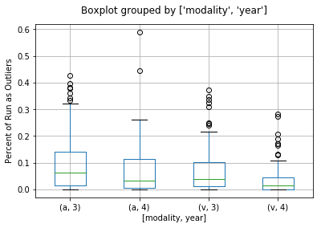


```python
%matplotlib inline
mdf.boxplot(by='scantype', column='outs')
plt.title('')
plt.ylabel('Percent of Run as Outliers')
plt.show()
```


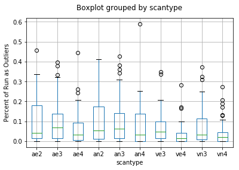


## Bringing It All Together


```python
overwrite_csv = 1

recall_thresh = 0
dprime_thresh = -2.5
pctout_thresh = 0.2

# Demographics 
qadf['age'] = ddf['age'] 
qadf['sex'] = ddf['sex']
qadf['subject'] = [subjid.split('_')[0] for subjid in qadf.index]

# Out-of-Scanner Comp
qadf['pass_recall'] = pdf['sum_comp_qs']

# Eprime Metrics
qadf['eprime_comp'] = edf['eprime_comp']
qadf['eprime_dprime'] = edf['eprime_dprime']
qadf['eprime_exists'] = edf['eprime_exists']

# Motion Measures
qadf['mean_fdrms'] = mdf['mean']
qadf['pct_outliers'] = mdf['outs']

# Behavioral Data (from External Spreadsheet)
bxdf = pd.read_csv('{}/bxCovs.csv'.format(wd))
bxcols = [col for col in bxdf.columns if not ('subject' in col) | ('year' in col)]
for col in bxcols:
    qadf[col] = np.nan
    try:
        for row in bxdf.index:
            subj = 'LD{}'.format(bxdf.loc[row, 'subject'].astype(int))
            yr = bxdf.loc[row, 'year'].astype(int)        
            qadf.loc[(qadf.subject==subj) & (qadf.year == str(yr)), col] = bxdf.loc[row, col]
    except:
        pass
    
# Calculate Subjects Lost
edrop = qadf.loc[(qadf.eprime_dprime < dprime_thresh)]
mdrop = qadf.loc[(qadf.pct_outliers > pctout_thresh)]
pdrop = qadf.loc[(qadf.pass_recall < recall_thresh) & (qadf.eprime_comp < 2)]
drop_inds = (edrop.index | mdrop.index | pdrop.index)

qadf['include'] = 1
qadf.loc[drop_inds, 'include'] = 0

print('Scans Dropped after E-Prime Threshold: ', edrop.shape[0])
print('Scans Dropped after Motion Threshold: ', mdrop.shape[0])
print('Scans Dropped after Recall Threshold: ', pdrop.shape[0])
print('Number of Scans Remaining after all Thresholds:', qadf.drop(drop_inds).shape[0])

if overwrite_csv == 1:
    qadf.to_csv('{}/allCovs.csv'.format(wd))
```

    Scans Dropped after E-Prime Threshold:  45
    Scans Dropped after Motion Threshold:  70
    Scans Dropped after Recall Threshold:  0
    Number of Scans Remaining after all Thresholds: 623


```python
modpair_dict = {'n3': ['an3', 'vn3'], 'e3': ['ae3', 've3'], \
                'n4': ['an4', 'vn4'], 'e4': ['ae4', 've4']}

twoscans = qadf.groupby(['subject', 'year', 'genre']).modality
#.transform(lambda x: str(x))
#qadf.loc[twoscans].head()
```


```python
visdf = qadf.loc[(qadf.modality=='v') & (qadf.include == 1)]
visdf.scantype.value_counts()
# visdf.to_csv('{}/v34_covariates.csv'.format(wd))
```


```python
visdf = qadf.loc[(qadf.modality=='v') & (qadf.include == 1)]
visdf.scantype.value_counts()
# visdf.to_csv('{}/allCovs.csv'.format(wd))
```


```python
qadf.loc[qadf.eprime_exists!=1, [col for col in qadf.columns if 'eprime' in col]].index.sort_values()
```


```python
[col for col in bxdf.columns.tolist() if 'v3' in col]
```


    []


# Extract ART Data (OLD CODE)
```
def extractArtData(artfile):
    # Read in Art File
    f = np.loadtxt(artfile)
    nvols = f.shape[0]

    # Extract Summary Outlier Vector
    nouts = f.shape[1] - 7 # Subtract out continuous covariates
    pouts = 100 * nouts / nvols
    outVec = f[:,0:nouts].sum(axis=1)

    # Calculate Framewise Displacement
    rpMat = f[:,-7:-1]
    rpMat[:,-3:] = (rpMat[:,-3:] * np.pi/180) * 50 # Convert degrees to radians, then arc length on a 50mm sphere
    fdVec = np.abs(np.diff(rpMat, axis=0)).sum(axis=1)
    meanFD = np.mean(fdVec)

    # Extract Global Signal Change Vector
    globalVec = f[:,-1]
    
    return  {'num_vols': nvols, 'art_outliers': nouts, 'pct_outliers': pouts, 'outVec': outVec, \
             'mean_global': np.mean(globalVec), 'globalVec': globalVec, 'meanFD': meanFD}

featdirbase = '/fs0/users/bailesk1/LD4_LongMod_FL/'

dfcols = ['subject','scantype', 'num_vols', 'fsl_mean', \
          'art_outliers', 'pct_outliers', 'outVec', 'mean_global', 'globalVec', 'meanFD']
mdf = pd.DataFrame( columns=dfcols) #data=dfdata,

for subj, stype in [x.split('_') for x in qadf.index]:
    artfile = '{}/{}/{}.feat/art/art_regression_outliers_and_movement.txt'.format(featdirbase, subj, stype)
    mcfile = '{}/{}/{}.feat/mc/prefiltered_func_data_mcf_rel_mean.rms'.format(featdirbase, subj, stype)
    
    try:
        # Export Data Series
        with open(mcfile, 'r') as f:
            abs_mean = f.read().strip('\n')
        art_data = {**{'subject': subj, 'scantype': stype, 'fsl_mean': float(abs_mean)}, ** mot_dict}
        
        mot_dict = extractArtData(artfile) 
        mc_series = pd.Series(data=art_data, name='{}_{}'.format(subj, stype))
        
        mdf = mdf.append(mc_series)
            
    except:
        continue
        
mdf.index = ['{}_{}'.format(x,y) for x,y in zip(mdf.subject, mdf.scantype)]
for ind, col in enumerate(['modality', 'genre', 'year']):
    mdf[col] = mdf['scantype'].apply(lambda x: x[ind])
    
    
```


```python


```
